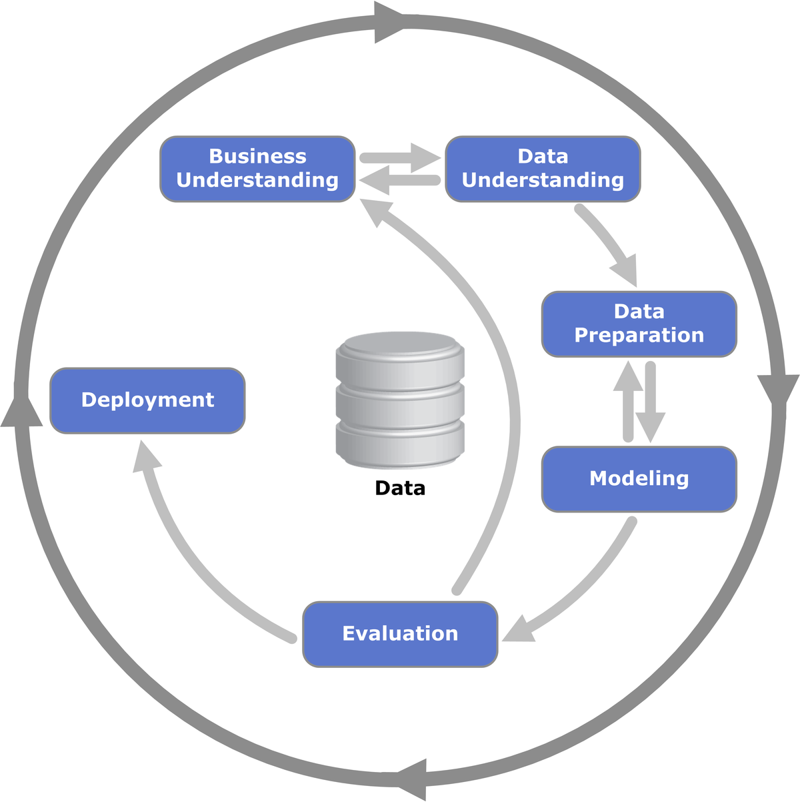

# Medical Assistant Bot Assignment

In this assignment, it's needed to create a medical assistant bot for QA (evaluated in single-turn QA).

To break down the problem, let's follow the CRISP-DM methodology:

## Business Understanding

First, some information is provided as statements:

1. It’s a single-turn QA task.
2. No interface is needed.
3. You can augment the provided dataset with other medical datasets if you feel it is necessary.
4. No third-party AI systems are allowed in any part of solution (such as OpenAI, Claude, or similar tools).

With this, I give some initial assumptions to the problem:
1. It's an Bot with directly user interaction.
    - An standalone predictor who receive "hello" and return "That disease is called X..." is not a prefarable solution.
2. It's a health-related bot.
    - The answers need to be strictly related to the topics provided in dataset. Some management of out-of-scope questions is needed.
3. We can be confident that the dataset is safe to use.
4. The dataset don't provide start_token and end_token delimiter for answer, so the entire answer is the correct answer.

#### 1. Data Preprocessing:
   - Ensure the data is structured appropriately for model training, validation, and testing.

#### 2. Model Training:
   - Develop a machine learning model using natural language processing (NLP) techniques to understand and respond to user queries.
   - Choose an appropriate architecture for the model, considering factors such as the complexity of the dataset and the computational resources available.

#### 3. Model Evaluation:
   - Evaluate the model's performance using appropriate metrics.
   - State your reasoning for using the chosen metrics.

#### 4. Example Interaction:
   - Include at least three example interactions where the user asks a question (similar to the provided dataset), and the model provides an answer.

#### 5. Documentation:
   - Provide a README file with a concise description of the approach used to tackle the problem.
   - Include details about any assumptions made during model development and training.
   - Describe the model's performance, highlighting its strengths and weaknesses.
   - Suggest potential improvements or extensions to the solution, such as refining the model architecture, etc.

## Submission Instructions:
   - Ensure the code is well-documented and organized, following best practices for readability and maintainability.
   - Include comments to explain the purpose and functionality of each code segment.
   - Upload the code to your GitHub account and send an email to `zara@supportiv.com` stating the completion of the assignment along with the GitHub link for the code base.

## Grading Rubric:
   - **Approach to the Problem:** Evaluation of the method used, including any assumptions made during model development.
   - **Code Documentation:** Assessment of the clarity and completeness of the code documentation, including comments and explanations.
   - **Model Performance:** Analysis of the model's performance using appropriate metrics and examples of predictions.
   - **Potential Improvements:** Evaluation of potential enhancements or extensions to the solution and their feasibility.

## Important Notes:
   - You must solve this problem independently without the assistance of third-party AI systems (such as OpenAI, Claude, or similar tools) in any part of your solution.
   - Consulting code documentation is permitted.
   - In your submission, include a statement confirming that you did not use AI assistance.

## Deadline:
   - 2 days after receiving the challenge.

## Queries/Clarifications:
   - Please reach out to `zara@supportiv.com` for any questions.
