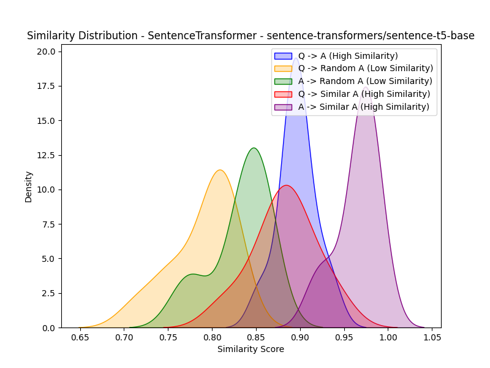
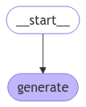
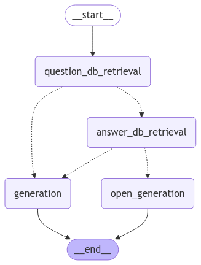

# Medical Assistant Bot Assignment

In this assignment, it's needed to create a medical assistant bot for QA (evaluated in single-turn QA).

To break down the problem, let's follow the CRISP-DM methodology:

## "Business" (Problem) Understanding

First, some information is provided as statements:

1. It’s a single-turn QA task.
2. No interface is needed.
3. You can augment the provided dataset with other medical datasets if you feel it is necessary.
4. No third-party AI systems are allowed in any part of solution (such as OpenAI, Claude, or similar tools).

With this, I give some initial assumptions to the problem:
1. It's an Bot with directly user interaction.
    - An standalone predictor who receive "hello" and return "That disease is called X..." is not a prefarable solution.
2. It's a health-related bot.
   - The answers need to be strictly related to the topics provided in dataset. Some management of out-of-scope questions is needed.
3. We can be confident that the dataset is safe to use.
4. The dataset don't provide start_token and end_token delimiter for answer, so the entire answer is the correct answer.

## Data Understanding

In 01_01_data_exploration, I conduced some explorations and experiments, the most important insights:

   - Analysis of the number of tokens in (question, answer).
      - Question (min, max, mean): (4, 40, 12)
      - Answer (min, max, mean): (1, 267, 5645)
   - Removal of some whitespaces to avoid problems in some tokenizers models.
   - One question can be mapped to multiple answers.
   - One answer can be mapped to multiple questions.

In 01_02_data_exploration_similarity, some experimentes about models to improve metric of similarity has been conducted.
I don't use some hard criterion to do this, but try to look the model who predict:
   - High similarity
      - Question to Answer (QA)
      - Question to Similar SML generated Answer (QSA)
      - Answer to similar SML generated Answer (ASA)
   - Low similarity
      - Question to Random Answer from dataset (QRA)
      - Answer to Random Answer from dataset (ARA)

About the architecture in that step, generally we use sentence-transformers models (bi-encoder or cross-encoder) to measure that similarities.

After the experiments, I choose to proceed with sentence-t5-base, who use the encoder of T5 to generate the embeddings of the sentences. In the figure, the "High" and "Low" expected can be considered the error, more time can be spent in that analysis to better fit that model.

## Data Preparation

As mentioned in Data Understanding, I choose to keep all data and try to process to better fit some modeling.

I choose to proceed with LM/LLM's approach and that implies I don't need to any pre-processing in the data to avoid problems in real distribution of words when we tokenize and use forwards steps in the model.

The assisgnment propose split the data in train/test/validation. In my specific case, I don't need to use all of them, but prefeer to split only to keep this discussion in mind.

I choose to use a random split instead of stratified by topic because that can rely in some good assumptions like the model know all the scope of questions. (Let's assume the model can have open conversation in future)

Only about the size of the dataset, my expectation about the model inference time and the time to evaluate, I choose (train-test-val) (90-5-5) proportion but only use ~100-300 test samples because of the time. That's important to mention because rely in extremely small test set and bias in evaluation (major part of the evals are not present in train DS).

## Modeling

For the modeling, we have 3 major strategies to follow:
1. Extractive QA
   - We can train a encoder model (like BERT) to predict the start and end token of the answer.
   - Pros
      - The model can be trained in a supervised way.
   - Cons
      - We have to consider the entire answer as the correct answer. We have answer with more than 5k of tokens, that's near to ModernBERT limit.
      - The model can't generate new answers.
      - The model can't deal with out-of-scope questions.
2. Generative QA
   - We can use a generative model to generate the answer based in provided context.
   - Pros
      - The model can generate new answers.
      - The model can deal with out-of-scope questions.
      - We can define flows to deal with different cases of interactions.
      - Can add information to the model using RAG.
   - Cons
      - Hallucination
      - Number of parameters
      - Inference time and cost (if use local LLM's)
3. OpenQA
   - We can use a model to generate the answer.
   - Pros
      - Same of generative QA except the usage of RAG (consider no context is provided).
   - Cons
      - Same of generative QA.
      - Rely only in the model trained knowledge.

Without the cons of Extractive QA, I choose to proceed with the other options.
Because of the time and dataset duplicated maps between question and answers, I tried to avoid finetuning the model using LoRA and QLora.

Let's advance with Generative QA and OpenQA solution.

### 02_01_modeling_opengen
To start the development, I choose as baseline a opengen. Simple and direct generation of the answer based on the query. .
Some examples of the results are available at the end of the notebook, generated in test set.

That's the graph of the naive rag:

### 02_02_naive_rag
In this notebook we use naive RAG technique, without consider so much of the previous analysis.

After load the data, we use an simple pipeline of rag to extract similar questions to provided query and use the top-3 documments as context.
If the context exceed the context size, we have the right truncate of ollama.

That's the graph of the naive rag:

### 02_03_modeling_adanved_rag
In this notebook we use a more advanced RAG technique, considering the previous analysis.

Let's consider some insights:
   - If the user query matchs the question, we can use the answer to generate the answer.
   - If the user query matchs some part of the answer, we can use the answer to generate the answer.
   - If the user don't match any question or answer, we can rely in open generation flow.

To deal with larger retrieved answers, I choose to use semantic chunking using same embed all-miniLM-L6-v2 model to split the answer in chunks.
Each chunk of possible retrieval will have, at maximum, near (because of semantic splitting) to 500 tokens.

About the chunk in questions, we know the maximum number of tokens in questions is 40, choose to keep the page_content chunks near to 128.

To have multiple steps of retrival, I choose to create two different vector db's to address the best cases of queries matching (question and answer).

As we can see in the flow, we only rely in the open generation if no context is provided by the two retrievals steps with similarities filter manually defined to 0.7 to question and 0.5 to answer.

That's the graph of the advanced rag:

## Evaluation

To evaluate the models, we can use the metrics:
   - BLEU
      - n-gram overlap between answer and predicted answer.
   - BERTScore
      - Similarity between answer and predicted answer using distillbert.
      - Also compute hard classification metrics.
   - Sentence Transformer Similarity
      - Similarity between answer and predicted answer using sentence-t5 (biased by the data_exploration_similarity).
   - Mean generation duration
      - Time(seconds) to generate the answer.
   - Mean generation number of tokens
      - Number of tokens in the generated answer.

All the results are available directly in the notebooks and in results folder.

As we know, evaluate LLM's spent a lot of time, the size of test set can bias the undersdanting of the model performance.

## Future work

As a possible future work I suggest:
   - Spend more time in experimentations with different SML/LLM's in the flow.
   - Finetune using LoRA or QLoRA of the SML to address better possible open generations.
   - Generate summaries and expansions of the dataset to better cover direct match between user query and question (best case).
   - Guardrails in the output for both generation and open_generation cases.
