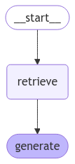

# Medical Assistant Bot Assignment

In this assignment, the goal is to create a medical assistant bot for QA (evaluated in single-turn QA).

To break down the problem, let's follow the CRISP-DM methodology:

## **"Business" (Problem) Understanding**

First, some information is provided as statements:

1. It’s a single-turn QA task.
2. No interface is needed.
3. You can augment the provided dataset with other medical datasets if you feel it is necessary.
4. No third-party AI systems are allowed in any part of the solution (such as OpenAI, Claude, or similar tools).

With this, I make some initial assumptions about the problem:
1. It's a bot with direct user interaction.
   - A standalone predictor that receives "hello" and returns "That disease is called X..." is not a preferable solution.
2. It's a health-related bot.
   - The answers must be strictly related to the topics provided in the dataset. Some management of out-of-scope questions is needed.
3. We can assume that the dataset is safe to use.
4. The dataset does not provide `start_token` and `end_token` delimiters for answers, so the entire answer is considered correct.

---

## **Data Understanding**

In the `01_01_data_exploration` notebook, I conducted some explorations and experiments. Here are the most important insights:

- Analysis of the number of tokens in (question, answer):
  - **Question (min, max, mean)**: (4, 40, 12)
  - **Answer (min, max, mean)**: (1, 267, 5645)
- Removed unnecessary whitespaces to avoid issues with some tokenization models.
- A single question can be mapped to multiple answers.
- A single answer can be mapped to multiple questions.

In `01_02_data_exploration_similarity`, I conducted some experiments with models to improve similarity metrics. Instead of using strict criteria, I evaluated models based on their predictions:
- **High similarity:**
  - Question to Answer (QA)
  - Question to Similar SML Generated Answer (QSA)
  - Answer to Similar SML Generated Answer (ASA)
- **Low similarity:**
  - Question to Random Answer from the dataset (QRA)
  - Answer to Random Answer from the dataset (ARA)

For this step, I generally used **sentence-transformer models** (bi-encoder or cross-encoder) to measure similarities.

After the experiments, I decided to proceed with **sentence-t5-base**, which uses the encoder of T5 to generate sentence embeddings. In the figure below, "High" and "Low" expected similarities represent the model error. Spending more time on this analysis could further improve the model.

---

## **Data Preparation**

As mentioned in the Data Understanding section, I chose to keep all data and process it to better fit the modeling.

I decided to proceed with **LM/LLM-based approaches**, which implies that I didn’t need extensive pre-processing to preserve the real distribution of words when tokenizing and forwarding inputs through the model.

The assignment suggests splitting the data into **train/test/validation** sets. In my case, I didn’t use all of them but preferred to maintain a split to follow best practices.

I chose a **random split** instead of a stratified split by topic, assuming the model can handle a broader scope of questions. This assumption supports the idea of future open conversations.

Regarding dataset size, due to the expected inference time and evaluation time, I chose a **90/5/5** (train-test-validation) split but used only **~100-300 test samples** to reduce processing time. This should be noted as it introduces a bias due to the small test set size, where many evaluation samples are not present in the training set.

---

## **Modeling**

For the modeling, there are three main strategies to follow:
1. **Extractive QA**
   - Train an encoder model (like BERT) to predict the start and end tokens of the answer.
   - **Pros:**
     - The model can be trained in a supervised way.
   - **Cons:**
     - The entire answer must be considered correct. Some answers contain over 5k tokens, which is near the limit for modern BERT models.
     - The model cannot generate new answers.
     - The model cannot handle out-of-scope questions.

2. **Generative QA**
   - Use a generative model to produce answers based on the provided context.
   - **Pros:**
     - The model can generate new answers.
     - The model can handle out-of-scope questions.
     - Customizable flows can handle different interaction scenarios.
     - Can include external information using RAG (Retrieval-Augmented Generation).
   - **Cons:**
     - Prone to hallucination.
     - Large number of parameters.
     - Inference time and cost (if using local LLMs).

3. **OpenQA**
   - Use a model to generate answers without additional context.
   - **Pros:**
     - Same as Generative QA, except it doesn’t use RAG (no external context is provided).
   - **Cons:**
     - Same as Generative QA.
     - Relies solely on the model's trained knowledge.

Given the disadvantages of Extractive QA, I chose to proceed with the other options. Due to time constraints and the dataset's duplicated mappings between questions and answers, I avoided fine-tuning the model using LoRA or QLoRA.

Let’s proceed with the **Generative QA** and **OpenQA** solutions.

---

### **02_01_modeling_opengen**

To start the development, I chose **Open Generation** as the baseline—a simple and direct generation of answers based on the query.  
Some examples of the results are available at the end of the notebook, generated from the test set.

This is the graph of the naive RAG approach:

---

### **02_02_naive_rag**

In this notebook, I used a **naive RAG technique**, without considering the detailed analysis from previous steps.

After loading the data, I used a simple RAG pipeline to extract similar questions for the provided query and used the **top-3 documents** as context.  
If the context exceeded the maximum size, Ollama automatically truncated the input.

This is the graph of the naive RAG:

---

### **02_03_modeling_advanced_rag**

In this notebook, I implemented a more advanced RAG technique, considering the previous analyses.

Key insights:
- If the user query matches a question, we can use the corresponding answer.
- If the user query matches part of an answer, we can use the related answer to form a response.
- If the query doesn’t match any questions or answers, we rely on the **open generation** flow.

To handle large retrieved answers, I used **semantic chunking** with the `all-miniLM-L6-v2` model to split the answers into chunks.  
Each retrieval chunk has a maximum size of around **500 tokens**.

For questions, the maximum token length is **40**, so I kept the `page_content` chunks around **128 tokens**.

To perform multi-step retrieval, I created two different vector databases to handle the best case for query matching (question and answer).

As seen in the flowchart, open generation is only triggered if no relevant context is provided by the two retrieval steps with manually defined similarity thresholds (**0.7** for questions and **0.5** for answers).

This is the graph of the advanced RAG:

---

## **Evaluation**

To evaluate the models, I used the following metrics:
- **BLEU**: Measures n-gram overlap between the answer and predicted answer.
- **BERTScore**: Measures similarity between the answer and predicted answer using `distilbert`.
  - Also computes hard classification metrics.
- **Sentence Transformer Similarity**: Measures similarity using `sentence-t5` (based on the Data Exploration Similarity analysis).
- **Mean Generation Duration**: Time (in seconds) taken to generate the answer.
- **Mean Generation Number of Tokens**: Number of tokens in the generated answer.

All results are available in the notebooks and the `results` folder.

Since LLM evaluation is time-consuming, the small test set size may introduce bias in understanding model performance.

---

## **Future Work**

Suggested improvements:
- Perform more experiments with different SML/LLM models in the pipeline.
- Fine-tune the SML using LoRA or QLoRA to improve open generation performance.
- Generate summaries and expansions of the dataset to improve direct matches between user queries and questions (best case).
- Implement guardrails for both `generation` and `open_generation` outputs.
- Introduce specific metrics for retrieval and generation steps:
  - Metrics to check if the model is responding.
  - Metrics to check if the model is responding correctly.
  - Metrics to check if the model is responding appropriately.
  - Hallucination detection metrics.